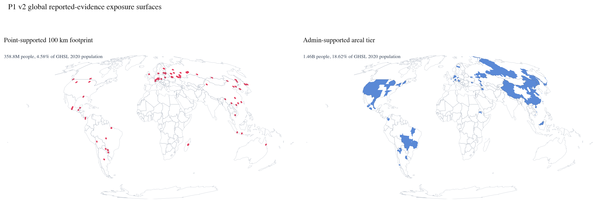
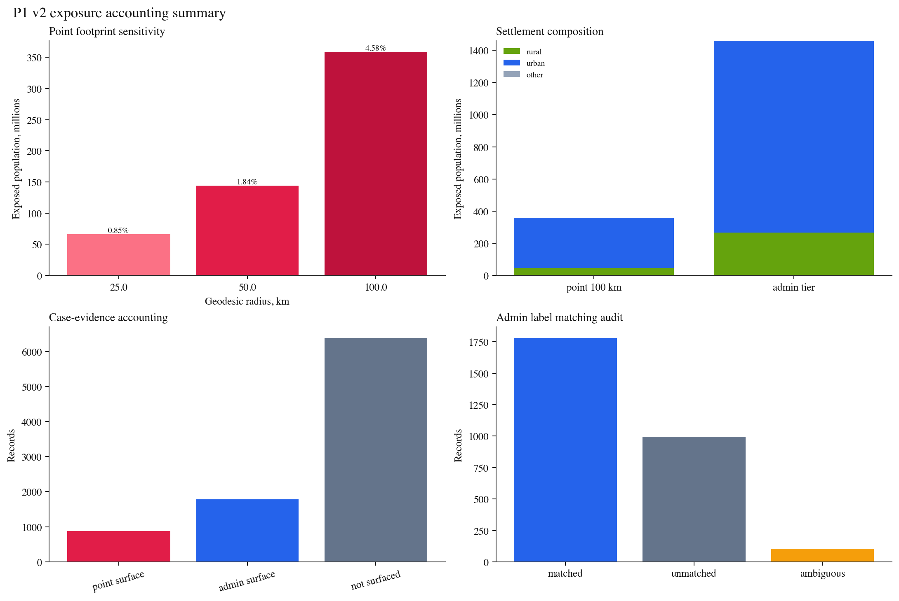

<!-- Target venue: Epidemics or J. R. Soc. Interface. -->
<!-- Sole author: Ian T. Helfrich. No funders, affiliations, reviewers, or editorial board are listed. -->
<!-- Draft rule: figures are read from data/outputs so the paper stays tied to the pipeline. -->

```{python}
from pathlib import Path

OUTPUT_DIR = Path("../../data/outputs")
```

# Intro

TODO: State the reported-evidence exposure question. Do not frame the method as outbreak-origin inference.

# Related

TODO: Position the paper against Brockmann and Helbing effective distance, Wesolowski et al. mobility work, and Tatem et al. gridded population epidemiology.

# Model

TODO: Define the population grid, reported-evidence support, point-supported footprints, admin-supported areal tier, and optional effective-distance geometry.

# Estimation

TODO: Separate exposure accounting from parameter estimation. State which components are estimated, which are audited, and which remain descriptive in the current data regime.

# Identification

TODO: State the weak-identification problem plainly. Global hantavirus reports are too sparse for cell-specific detection weights, so the method must stay parsimonious.

# Data

TODO: Document GenBank/BioSample, CDC NNDSS, WHO Disease Outbreak News, GHSL population, GHS-SMOD, and Natural Earth boundaries.

# Validation

TODO: Describe held-out validation once implemented. For the current build, report accounting checks and reconciliation against raster cell counts.

{#fig-exposure-surfaces}

{#fig-exposure-summary}

# Discussion

TODO: Explain what the method can support now, what it cannot identify yet, and which data layers would tighten the exposure estimates.
